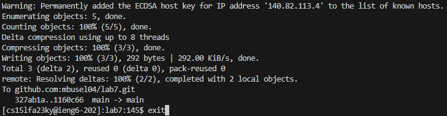

# Lab Report 4

In short to fix the problem in the repository you need to follow these steps:
```
ssh<space>cs15lfa23ky@ieng6-202.ucsd.edu<enter>
git<space>clone<space><right-click><enter>
cd<space>l<tab><enter>
bash<space>t<tab><enter>
vim<space>L<tab>.<tab><enter>
:$?1?s/1/2<enter>
:wq<enter>
<up><up><enter>
git<space>add<space>L<tab>.<tab><enter>
git<space>commit<space>+m<space>"fix"<enter>
git<space>push<enter>
exit<enter>
```
### Connecting to Ieng6:
Open a terminal window in VSCode:


Type the `ssh` with the username and address of the server to connect to ieng-6, and press `<enter>` to connect:
`ssh<space>cs15lfa23ky@ieng6-202.ucsd.edu<enter>`


\* *You might need to type in your password if your ssh keys are not set up*

If you connected successfully your terminal should look something like this:


### Cloning Repository:
Go to the GitHub page of the repository we want to fork, and click a `Fork` button:


Fill up the required lines and press `create fork`:


Now click on the green `Code` button, select `SSH` tab, and copy the address to the clipboard:


Go back to VSCode and type in the command:
`git<space>clone<space>` and then paste address and execute command using `<right-click><enter>`


After this, you should see the repository appearing on the ieng-6 server.

### Running Test:
Change the directory to the recently cloned repository using `cd<space>l<tab><enter>` (there is only one directory starting with `l`, so the tab will fill up the path for us) and run a bash script to compile and test Java code:
`bash<space>t<tab><enter>` (only one file with a name starting on `t`, so the tab will autocomplete it for us.


We can see that the JUnit test failed one of the tests.

### Fixing the Error:
Luckily we know that the problem is in the `ListExamples.java` file, where we mistyped one of the lines with `index1` instead of `index2`.
Type in `vim<space>L<tab>.<tab><enter>` (the first tab will fill up a name, and the second will fill up `.java` extension).


We should see a window such that, type in `:$?1?s/1/2<enter>` to navigate and fix the error, where:
- `:$` - goes to the last line of the file
- `?1?`- searches the first appearance of symbol `1` in the code from bottom to top.
- `s/1/` - go to insert mode and delete the symbol at the cursor at the first appearance of symbol `1` in the line.
- `2` - type in `2` in insert mode.


Now when an error is fixed we can save and exit using the command `:wq<enter>`:


Let's see if our fix fixed the problem, rerun the test script, by going back in history by 2 positions `<up><up><enter>`:


We should see a success message like this:


### Pushing to git:
Now let's add the changes to the git stage, so we can push it, type in `git<space>add<space>L<tab>.<tab><enter>`, where we add `ListExamples.java` to the stage:


Commit a change with a comment `fix`, type in `git<space>commit<space>+m<space>"fix"<enter>`:


The output will show us some information about commit, comment/committer/changed files. Make sure that we change only 1 file and type in `git<space>push<enter>` to push the commit:


After the push is done and we don't see any error messages we can disconnect from ieng-6, by executing `exit<enter>`:



And if we go back to our GitHub page we will see the latest commit and our file `ListExamples.java` being changed recently with a comment `fix`.


